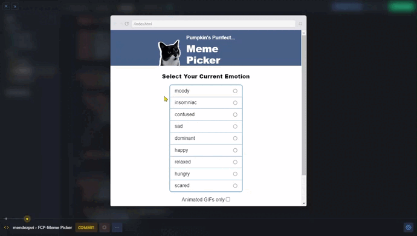

# Meme Picker

## *Overview* 🧐

The Meme Picker project is part of the **"Essential JavaScript Concepts"** module from the [**Scrimba**](https://v2.scrimba.com/home) [**Frontend Career Path**](https://v2.scrimba.com/the-frontend-developer-career-path-c0j) course. This app allows users to select an emotion and get a matching cat image or GIF, displayed in a modal. The app uses JavaScript to dynamically render the available emotions, filter the cats by selected emotion, and randomly display an image or GIF.

## *Screenshots* 📷

## *Pseudocode* 🖥️

1. **Get emotions from `catsData`**
    + Extract all emotion tags from the catsData array.
1. **Filter out duplicate emotions**
    + Ensure only unique emotions are used.
1. **Render emotions as radio inputs**
    + Dynamically create a radio button and label for each unique emotion.
1. **Highlight the selected emotion**
    + When a radio button is selected, highlight the corresponding label.
1. Filter cat images and GIFs based on the selected emotion
    + Use the selected emotion and filter catsData to get the matching cats.
1. **Randomly select a cat**
    + If multiple cats match the selected emotion, randomly pick one.
1. **Render the selected image or GIF in a modal**
    + Display the randomly selected cat’s image or GIF inside a modal.
1. **Close the modal**
    + Provide a function to close the modal when the close button is clicked.

## *Links* 🔗

[Live site](https://mendezpvi.github.io/fcp-meme-picker/) 👈

[Scrim code](https://v2.scrimba.com/s0nu96bnu7) 👈

[Scrimba projects repository](https://github.com/mendezpvi/fcp-scrimba) 👈

## *What I learned* 🤓

🔳 **`for...of loop`:** For iterating over arrays and objects.

🔳 **`import/export`:** For modularizing code across files.

🔳 **Radio & checkbox inputs:** How to work with form inputs and their `checked` states.

🔳 **`querySelector`:** For selecting DOM elements dynamically.

🔳 **`getElementsByClassName`:** For accessing groups of elements and applying bulk actions.

🔳 **`classList.remove`:** For manipulating class names and changing styles.

🔳 **Array methods like `.includes()` and `.filter()`:** Essential methods for array filtering and searching.

🔳 **Nested CSS:** Writing cleaner and more modular CSS by nesting styles for better organization.

## *Resources* 🗃️

🗃️ [Frontend Career Path](https://v2.scrimba.com/the-frontend-developer-career-path-c0j) by Scrimba

## *Author* 🔰

✨ Frontend Mentor - [@medezpvi](https://www.frontendmentor.io/profile/mendezpvi)

✨ X (formerly Twitter) - [@medezpvi](https://x.com/mendezpvi)