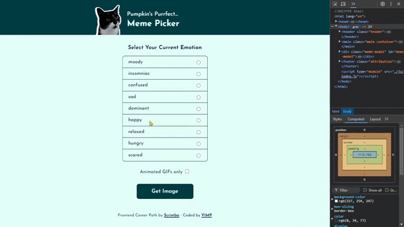

# Meme Picker



## *Screenshots* :camera:


## *Links* :link:

[Live Site URL](https://mendezpvi.github.io/fcp-meme-picker/) 👀

[Scrim](https://v2.scrimba.com/s0mmkkmh3r) 👀

[FCP projects](https://github.com/mendezpvi/fcp-scrimba) 👀

## *I learnt* :nerd_face:

✅ for of - a nicer way of iterating.

✅ import / export

✅ radio & checkbox input - getting a straight true or false from our users.

✅ querySelector - a more powerful way of grabbing elements.

✅ getElementsByClassName - grabbing all elements with a given class with one line of code.

✅ classList.remove - remove classes with JS.

✅ .includes() - a method for checking if an array holds a given value.

✅ .filter() - getting only the elements we want from an array.

## *Steps* :footprints:

1️⃣ The `getEmotions` and `renderEmotionsRadios` functions work together to provide an interface that allows the user to select an emotion to filter the memes. `getEmotions` extracts all unique emotions from the dataset and `renderEmotionsRadios` uses these emotions to create radio controls that the user can select. In the end, `renderEmotionsRadios` is called to render the controls in the interface based on the data provided by `catsData`.

```js
// Gets all unique emotions from an array of cat objects.
// @param { Arr } cats - An array of cat objects.
// @returns { Arr } An array of unique emotions.

function getEmotions(cats) {

  // Initializes an empty array 
  //to store the unique emotions.
  const emotionsArr = []

  // Iterate over each cat object in the array.
  for (let cat of cats) {

    // Iterate over each emotionTags 
    //of the current cat object.
    for (let emotion of cat.emotionTags) {

      // If the emotion is not already 
      //in the arrangement, add it.
      if (!emotionsArr.includes(emotion)) {
        emotionsArr.push(emotion)
      }
    }
  }

  // Returns the arrangement of single emotions.
  return emotionsArr
}

/*-------------------------------------------------*/

// Renders radio controls for each unique emotion found in the cats array.
// @param {Array} cats - An array of cat objects.

function renderEmotionsRadios(cats) {

  // Gets all the unique emotions of cats. 
  const emotionsAll = getEmotions(cats)

   // Initializes an empty string to store the radio elements.
  let radioItems = ''

  // Iterate over each emotion and 
  // create a radio element for each one.
  for (let emotion of emotionsAll) {

    // Adds the HTML for a radio control 
    // with the current emotion.
    radioItems += `
      <div class="radio">
        <label for="${emotion}">${emotion}</label>
        <input type="radio" id="${emotion}" value="${emotion}" name="emotions">
      </div>
    `
  }

  // Inserts the radio elements in the `radiosWrap` container.
  radiosWrap.innerHTML = radioItems
}

/*-------------------------------------------------*/
// Call the `renderEmotionsRadios` function 
// with the `catsData` dataset.
renderEmotionsRadios(catsData)
```

2️⃣ `HighlightCheckedOption` is activated when a user changes their radio selection. It removes the highlighting of all options and then highlights the currently selected option. This improves the user experience by providing clear visual feedback of their choice.

```js
// {Event} e - The event triggered by changing 
// the radio selection.

function highlightCheckedOption(e) {

  // Gets all elements with class "radio".
  const radios = document.getElementsByClassName("radio")

  // Remove the "isChecked" class from all 
  // radio elements to remove the highlighting.
  for (let radio of radios) {
    radio.classList.remove("isChecked")
  }

  // Add the "isChecked" class to the parent element 
  // of the selected radio to highlight it.
  document.getElementById(e.target.id).parentElement.classList.add("isChecked")
}
```

3️⃣ The `getMatchingCatsArr`, `getSingleCatObject` and `renderMeme` functions work together to provide a personalized user experience. `getMatchingCatsArr` filters the data based on the user's selections, `getSingleCatObject` gets a single cat object from the filtered set, and `renderMeme` displays this object as a meme in a modal. This allows users to view custom memes based on their emotional preferences and whether they prefer GIFs or static images.


```js
// Gets an array of cat objects matching the user's selection.
// @returns {Array} An array of cat objects matching the filter criteria.

function getMatchingCatsArr() {
  // Gets the radio control selected by the user.
  const radioSelec = document.querySelector("input[type='radio']:checked")

  // Gets the checkbox control selected by the user.
  const checkboxSelec = document.querySelector("input[type='checkbox']:checked")

  // Check if there is a radio selection.
  if (radioSelec) {
    // Gets the value of the selected radio control.
    let radioValue = radioSelec.value


    // Filter the `catsData` array to get 
    // the cats that match the selected emotion.
    const matchingCatsArr = catsData.filter(function(cat) {

      if (checkboxSelec) {

        // If a checkbox is selected, filter also 
        // by cats that are GIFs.
        return cat.emotionTags.includes(radioValue) && cat.isGif
      } else {
        // If no checkbox is selected, just filter by emotion.
        return cat.emotionTags.includes(radioValue)
      }
    })
    // Returns the filtered array.
    return matchingCatsArr
  }
}

/*-------------------------------------------------*/
// Gets a single cat object from the filtered array.
// @returns {Object} A cat object to display as a meme.


function getSingleCatObject() {
  // Gets the filtered array of cat objects.
  const catsArr = getMatchingCatsArr()

  // If there is only one cat in the array, 
  // return it.
  if (catsArr.length === 1) {
    return catsArr[0]
  } else {
    // If there is more than one, 
    // select one at random and return it.
    let newIndex = Math.floor( Math.random() * catsArr.length )
    return catsArr[newIndex]
  }
}

/*-------------------------------------------------*/
// Renders a meme in a modal based on the user's selection.

function renderMeme() {
  // Gets a single cat object to display as a meme.
  const catObject = getSingleCatObject()

  // Displays the modal for the meme.
  memeModal.style.display = "block"

  // Inserts the cat image in the modal.
  memeModalInner.innerHTML = ``
}
```

## *Author* :beginner:

✨ Frontend Mentor - [@mendezpvi](https://www.frontendmentor.io/profile/mendezpvi)
